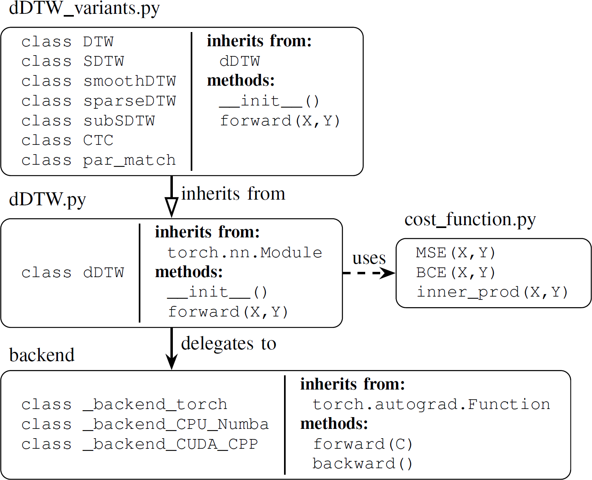

Architecture
============

The toolbox separates the *specification* of an alignment objective from the
heavy dynamic-programming computation. This mirrors the graph-based formulation
in the paper. [#zeitler2026toolbox]_

Frontend
--------

The central frontend is ``ddtw.ddtw.dDTW``, a ``torch.nn.Module``. 
It
defines an alignment graph through:

* a local cost function,
* an aggregation operator,
* step sizes,
* global or local step weights,
* start and end boundary conditions,
* optional boundary penalties,
* sequence lengths and normalization.

The predefined classes in ``ddtw.ddtw_variants`` are thin frontends
that fix these parameters for standard objectives such as ``SDTW``, ``CTC`` and
``partial_matching``. Users can still instantiate ``dDTW`` directly to build
new graph configurations or hybrid objectives.

Cost Matrix
-----------

When ``X`` and ``Y`` are passed to a loss, the frontend first computes the local
cost matrix ``C``. The matrix contains all pairwise values ``c(x_n, y_m)``. The
toolbox also accepts a precomputed ``C`` directly, which is useful when a model
or task-specific routine computes the local costs.

Backend Dispatch
----------------

The alignment cost and its gradient are computed by backend classes that extend
``torch.autograd.Function``. They implement explicit forward and backward
dynamic-programming recursions. This backend computation is shared by the
alignment variants: changing from SDTW to CTC or partial matching changes the
graph configuration, not the core dynamic-programming implementation.

The ``backend`` argument of ``dDTW`` selects one of three concrete backend
modules, or the ``auto`` dispatcher:

* ``auto``: selects ``cuda_cpp``, then ``cpu_numba``, then ``torch``.
* ``torch``: reference PyTorch implementation in ``backend/backend_torch.py``.
* ``cpu_numba``: Numba-accelerated CPU implementation in
  ``backend/backend_cpu_numba.py``.
* ``cuda_cpp``: optimized CUDA extension backend in
  ``backend/backend_cuda_cpp.py``.

Backend Module Structure
------------------------

The backend files are intentionally similar:

* local minimum-function definitions or dispatch constants,
* forward dynamic-programming routine,
* backward dynamic-programming routine,
* one ``torch.autograd.Function`` class,
* optional debug matrix storage through ``store_debug``.

The Torch and CPU Numba modules contain their minimum-function implementations
directly in Python/Numba. The CUDA C++ backend delegates to the compiled
extension; its minimum functions live in ``backend/csrc/ddtw_cuda.cu`` and are
selected by integer dispatch ids. The CUDA backend follows the same broad
forward/backward extension pattern used in prior PyTorch Soft-DTW CUDA
implementations. [#maghoumi2021]_

.. rubric:: References

.. [#zeitler2026toolbox] J. Zeitler and M. Müller, "dDTW: A Unified and
   Efficient Toolbox for Differentiable Sequence Alignment," submitted, 2026.
.. [#maghoumi2021] M. Maghoumi, E. M. Taranta, and J. LaViola, "DeepNAG:
   Deep Non-Adversarial Gesture Generation," in *Proceedings of the
   International Conference on Intelligent User Interfaces (IUI)*,
   College Station, Texas, USA, 2021, pp. 213-223.
