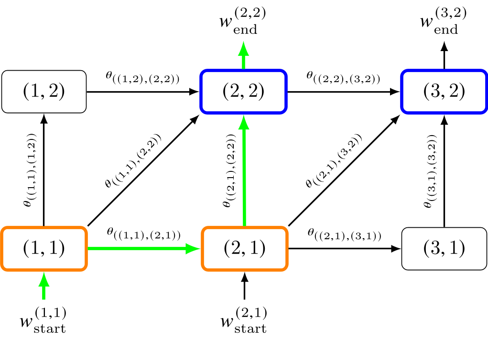
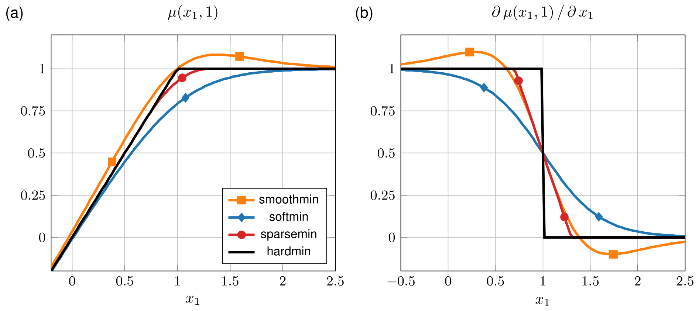

Core Concepts
=============

The following introduction to the dDTW graph is based on concepts introduced by
Mensch & Blondel [#mensch2018]_ and Zeitler & Müller. [#zeitler2026ctc]_

dDTW models monotonic sequence alignment as path-cost aggregation on a
weighted directed acyclic graph. The presented theory is expressed in one-based notation,
matching the paper. The toolbox uses zero-based tensor indices internally, so a
paper vertex :math:`(1, 1)` is represented by index ``[0, 0]`` in code.
[#zeitler2026toolbox]_

   Example alignment graph with
   :math:`\mathcal{I}=[1{:}3]\times[1{:}2]`,
   :math:`\mathcal{S}=\{(1,0),(0,1),(1,1)\}`,
   start vertices :math:`\mathcal{B}_\mathrm{start}=\{(1,1),(2,1)\}`,
   end vertices :math:`\mathcal{B}_\mathrm{end}=\{(2,2),(3,2)\}`, and one
   highlighted path.

Definition of the Alignment Graph
---------------------------------

Let

.. math::

   X=(x_1,\ldots,x_N),\qquad
   Y=(y_1,\ldots,y_M)

be two sequences with elements :math:`x_n\in\mathcal{F}_X` and
:math:`y_m\in\mathcal{F}_Y`. In general, we assume :math:`X` to be a sequence of
DNN predictions and :math:`Y` a sequence of training targets. In the toolbox, we represent
these sequences as ``torch.tensor`` objects with shapes ``(B,N,D)`` and ``(B,M,D)``,
respectively, where ``B`` denotes batch size, ``N`` and ``M`` denote sequence lengths, and
``D`` denotes feature dimensions.  

The alignment graph is specified by vertices,
directed edges, edge weights, boundary conditions, and the paths induced by
these choices.

Vertices
~~~~~~~~

Temporal correspondences :math:`(x_n,y_m)` are represented by vertices
:math:`p=(n,m)` on the grid

.. math::

   \mathcal{I}:= [1{:}N]\times[1{:}M].

Thus, every vertex corresponds to one possible local pairing between the two
sequences.

Edges
~~~~~

Allowed alignment steps are collected in

.. math::

   \mathcal{S}:=
   \{(i_s,j_s)\mid s\in[1{:}S]\}\subset\mathbb{N}_0^2,
   \qquad i_s+j_s\geq 1.

They induce directed edges

.. math::

   \mathcal{E}:=
   \{(p',p)\in\mathcal{I}^2\mid p-p'\in\mathcal{S}\}.

Because every step increases at least one index, the graph
:math:`(\mathcal{I},\mathcal{E})` is acyclic and can be evaluated in
topological order. [#mensch2018]_ In the toolbox, :math:`\mathcal{S}` is
defined via the variable ``step_sizes`` as a list of tuples
``[[i_1,j_1], ..., [i_S,j_S]]``.

Edge Weights
~~~~~~~~~~~~

A local cost function

.. math::

   c:\mathcal{F}_X\times\mathcal{F}_Y\rightarrow\mathbb{R}

quantifies the dissimilarity between sequence elements. In the toolbox, cost functions
can be selected from ``("MSE", "BCE", "CTC")``, where the latter denotes the inner product
between its inputs. Optional step weights

.. math::

   \mathbf{W}\in\mathbb{R}^{N\times M\times S}

modify the cost depending on the cell :math:`(n,m)` and incoming step
:math:`s`. For an edge :math:`(p',p)` with :math:`p=(n,m)` and
:math:`p-p'=(i_s,j_s)`, the edge weight is

.. math::

   \theta_{(p',p)}
   := c(x_n,y_m)\cdot\mathbf{W}(n,m,s).

The toolbox exposes constant step weights through a list of 
``global_step_weights=[w_1, ..., w_S]``, which 
define the same set of step weights for all cells. 
Cell-dependent weights are set through ``local_step_weights`` as a ``torch.tensor`` 
with shape ``(B,N,M,S)``.

Boundary Conditions
~~~~~~~~~~~~~~~~~~~

The allowed start and end vertices are sets

.. math::

   \mathcal{B}_\mathrm{start},\mathcal{B}_\mathrm{end}\subseteq\mathcal{I}.

In the toolbox, these are implemented as a list of lists 
``[[start_vertices_batch_1], ..., [start_vertices_batch_B]]`` and
``[[end_vertices_batch_1], ..., [end_vertices_batch_B]]``.
Additional boundary weights :math:`w_\mathrm{start}^p` and
:math:`w_\mathrm{end}^p` define costs for selected start and end vertices. These
weights are useful, for example, when the cost of subsequence alignments should be
compensated for the skipped prefix or suffix. In the toolbox, the weights are implemented
as lists of multiplicative weights ``[[start_weights_batch_1], ..., [start_weights_batch_B]]`` and
``[[end_weights_batch_1], ..., [end_weights_batch_B]]``, where the list lengths must correspond to
``B_start, B_end``.

Paths
~~~~~

A path :math:`(p_1,\ldots,p_L)\in\mathcal{I}^L` is a sequence of vertices
connected by edges :math:`(p_{\ell-1},p_\ell)\in\mathcal{E}`. Every valid path
starts at :math:`p_1\in\mathcal{B}_\mathrm{start}`. A full alignment path also
ends at :math:`p_L\in\mathcal{B}_\mathrm{end}`. 
For a vertex :math:`p\in\mathcal{I}`, let :math:`\mathcal{P}(p)` denote all
paths starting in :math:`\mathcal{B}_\mathrm{start}` and ending at :math:`p`.

Graph-Based Alignment Cost
--------------------------

The graph specifies which alignments are possible. The aggregation operator
specifies how the costs of all possible paths are combined into one loss.

Cost Aggregation Operators
~~~~~~~~~~~~~~~~~~~~~~~~~~

   Minimum functions :math:`\mu` and their partial derivatives.

Let :math:`\mu` aggregate a finite vector of path costs
:math:`v\in\mathbb{R}^D`. Important examples are the hard minimum

.. math::

   \mu_\mathrm{hard}(v)=\min_{d\in[1{:}D]} v_d

and the soft minimum

.. math::

   \mu_\mathrm{soft}(v)
   =
   -\gamma\log\sum_{d=1}^{D}\exp(-v_d/\gamma),
   \qquad \gamma>0.

The hard minimum selects a single lowest-cost path. The soft minimum performs a
smooth log-sum-exp aggregation and assigns gradient mass in a probabilistic way.
[#cuturi2017]_ The toolbox also includes smoothmin 

.. math::

    \mu_\mathrm{smooth}(v)=\langle v, \nabla\mu_\mathrm{soft}(v)\rangle

and sparsemin 

.. math::

    \mu_\mathrm{sparse}(v) = \min_{q\in\Delta^D} \langle v,q\rangle + \frac{\gamma}{2}\langle q, q-1\rangle

as differentiable variants. [#hadji2021]_ [#mensch2018]_ They can be used in
the differentiable recursion but do not yield the same global path-aggregation
equivalence that is guaranteed for hardmin and softmin. In the toolbox, choose
among ``("hardmin", "softmin", "smoothmin", "sparsemin")``.

Path-Prefix Cost
~~~~~~~~~~~~~~~~

The aggregated cost :math:`\mathbf{D}(p)` of all paths leading to a vertex
:math:`p` is

.. math::

   \mathbf{D}(p)
   :=
   \mu\left(
   \left(
   w_\mathrm{start}^{p_1}
   +\sum_{\ell=2}^{L}\theta_{(p_{\ell-1},p_\ell)}
   \right)_{(p_1,\ldots,p_L)\in\mathcal{P}(p)}
   \right).

This quantity contains the start weight of the first vertex and all edge
weights along the path prefix.

Alignment Loss
~~~~~~~~~~~~~~

The full alignment cost aggregates all path-prefix costs that terminate at an
allowed end vertex:

.. math::

   \mathcal{L}(X,Y)
   =
   \mu\left(
   \left(
   \mathbf{D}(p)+w_\mathrm{end}^{p}
   \right)_{p\in\mathcal{B}_\mathrm{end}}
   \right).

This is the mathematical loss represented by the ``forward()`` function of the
``dDTW`` module. Batch
averaging and optional length normalization are applied afterwards.

Dynamic Programming Formulation
~~~~~~~~~~~~~~~~~~~~~~~~~~~~~~~

Enumerating all paths is infeasible because their number grows exponentially
with sequence length. [#banderier2005]_ Instead, dDTW computes
:math:`\mathbf{D}` recursively.
Let

.. math::

   \Psi(p):=
   \{q\in\mathcal{I}\mid(q,p)\in\mathcal{E}\}

be the parent vertices of :math:`p`, and define

.. math::

   a(p)=
   \begin{cases}
   w_\mathrm{start}^{p}, & p\in\mathcal{B}_\mathrm{start},\\
   \infty, & \text{otherwise.}
   \end{cases}

Assuming that :math:`\mu` ignores infinite alternatives, the forward recursion
implemented in the toolbox is

.. math::

   \mathbf{D}(p)
   =
   \mu\left(
   a(p),
   \left(
   \mathbf{D}(q)+\theta_{(q,p)}
   \right)_{q\in\Psi(p)}
   \right).

Evaluating this recurrence over the DAG yields the accumulated cost matrix
:math:`\mathbf{D}\in\mathbb{R}^{N\times M}`. The ``backward()`` function of 
dDTW executes the reverse dynamic
program which computes gradients with respect to the local costs, and PyTorch then
propagates these gradients further to the input tensors. [#zeitler2026ctc]_
[#zeitler2026subseq]_

Summary: Toolbox Mapping
------------------------

The general ``dDTW`` class exposes the graph components directly:

* ``cost_function`` or a precomputed :math:`C` defines :math:`c(x_n,y_m)`.
* ``min_function`` selects :math:`\mu`.
* ``step_sizes`` defines :math:`\mathcal{S}`.
* ``global_step_weights`` and ``local_step_weights`` define :math:`\mathbf{W}`.
* ``B_start``, ``B_end``, ``start_penalty``, and ``end_penalty`` define
  :math:`\mathcal{B}_\mathrm{start}`,
  :math:`\mathcal{B}_\mathrm{end}`,
  :math:`w_\mathrm{start}`, and :math:`w_\mathrm{end}`.

The predefined variants in ``ddtw.ddtw_variants`` fix these components for
common objectives such as ``SDTW``, ``subSDTW``, ``partial_matching``, and
``CTC``.

.. rubric:: References

.. [#zeitler2026toolbox] J. Zeitler and M. Müller, "dDTW: A Unified and
   Efficient Toolbox for Differentiable Sequence Alignment," submitted, 2026.
.. [#mensch2018] A. Mensch and M. Blondel, "Differentiable Dynamic Programming
   for Structured Prediction and Attention," in *Proceedings of the
   International Conference on Machine Learning (ICML)*, Stockholm, Sweden,
   2018, pp. 3459-3468.
.. [#cuturi2017] M. Cuturi and M. Blondel, "Soft-DTW: a Differentiable Loss
   Function for Time-Series," in *Proceedings of the International Conference on
   Machine Learning (ICML)*, Sydney, NSW, Australia, 2017, pp. 894-903.
.. [#hadji2021] I. Hadji, K. G. Derpanis, and A. D. Jepson, "Representation
   Learning via Global Temporal Alignment and Cycle-Consistency," in
   *Proceedings of the IEEE/CVF Conference on Computer Vision and Pattern
   Recognition (CVPR)*, Virtual, 2021, pp. 11068-11077.
.. [#banderier2005] C. Banderier and S. Schwer, "Why Delannoy Numbers?"
   *Journal of Statistical Planning and Inference*, vol. 135, pp. 40-54, 2005.
.. [#zeitler2026ctc] J. Zeitler and M. Müller, "A Unified Perspective on CTC
   and SDTW Using Differentiable DTW," *IEEE Transactions on Audio, Speech and
   Language Processing*, vol. 34, pp. 936-951, 2026.
.. [#zeitler2026subseq] J. Zeitler and M. Müller, "Subsequence SDTW:
   Differentiable Alignment with Flexible Boundary Conditions," in
   *Proceedings of the IEEE International Conference on Acoustics, Speech, and
   Signal Processing (ICASSP)*, Barcelona, Spain, 2026.
