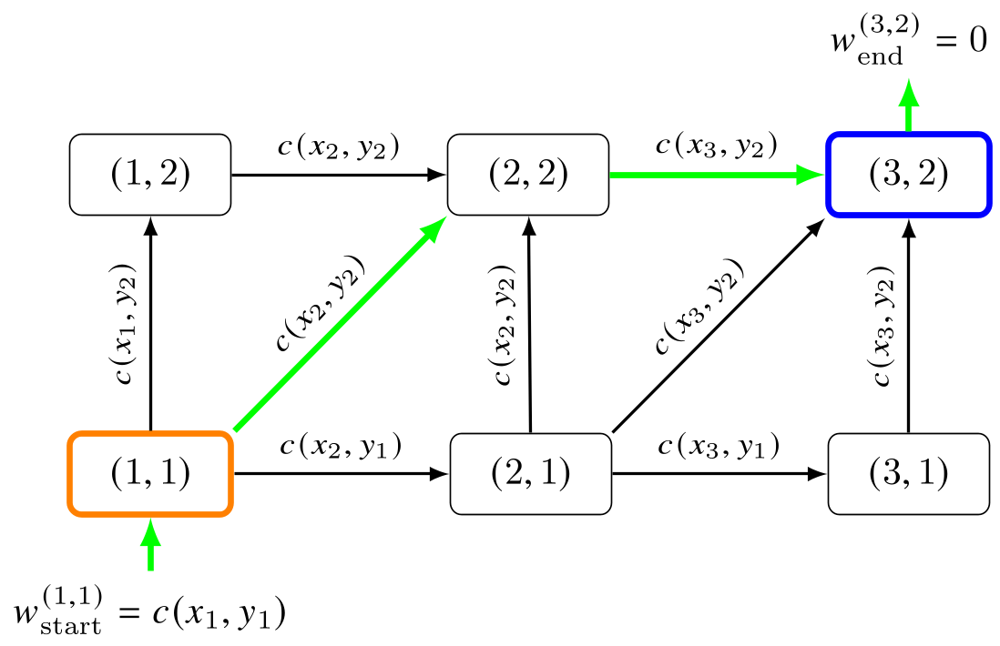
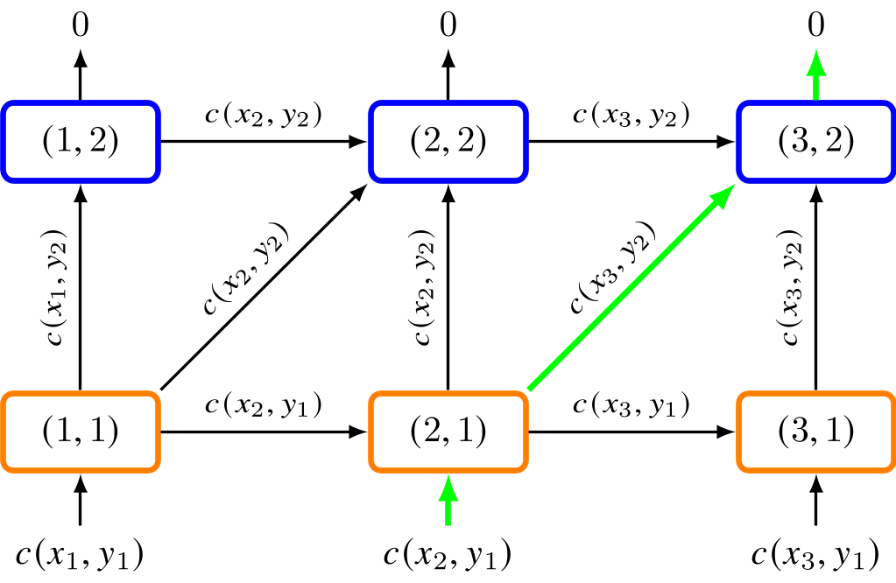
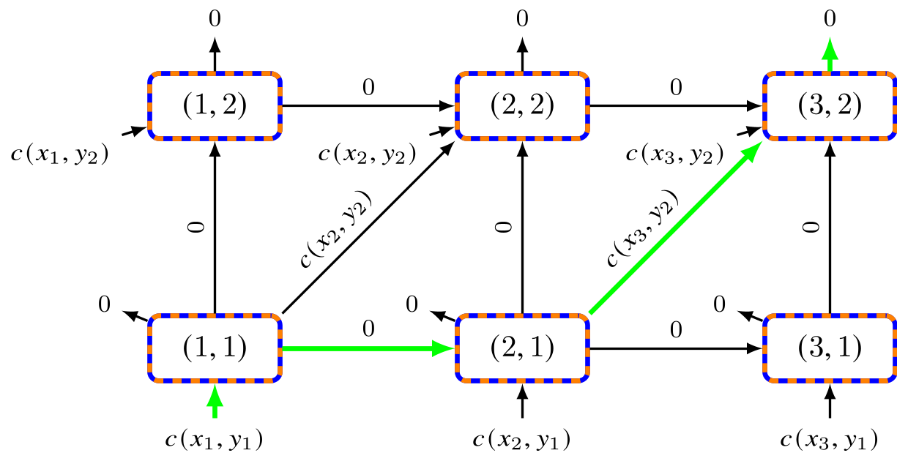
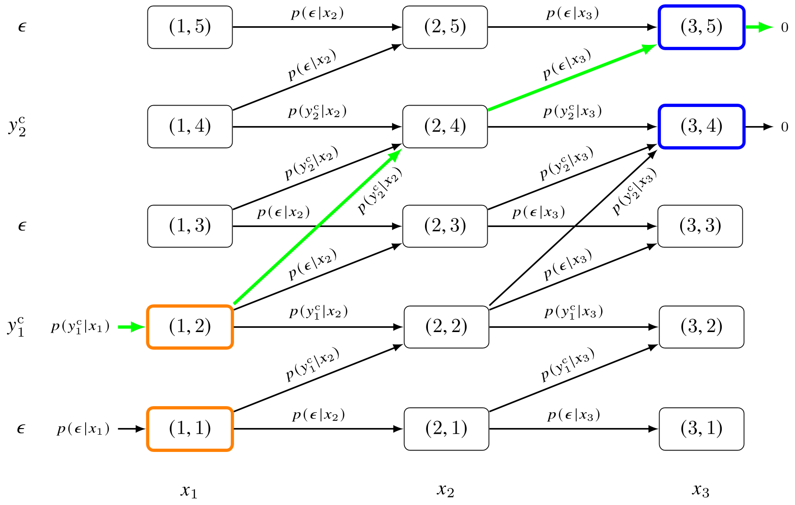

Built-In Variants
=================

The classes in ``ddtw.ddtw_variants`` are convenience frontends around the
general ``dDTW`` class. Each variant fixes the graph components introduced in
the core concepts:

.. math::

   \mathcal{S},\qquad
   \mathbf{W},\qquad
   \mathcal{B}_\mathrm{start},\qquad
   \mathcal{B}_\mathrm{end},\qquad
   \mu.

The table uses the paper's one-based notation. Tensor indices in the
implementation are zero-based.

Parameter Overview
------------------

.. |br| raw:: html

    

.. list-table::
   :header-rows: 1
   :widths: 15 18 18 18 16 18
   :class: wrap-table

   * - Variant
     - :math:`\mathcal{S}`
     - :math:`\mathbf{W}(n,m)`
     - :math:`\mathcal{B}_\mathrm{start}`
     - :math:`\mathcal{B}_\mathrm{end}`
     - :math:`\mu`
   * - ``DTW`` |br| ``SDTW`` |br| ``smoothDTW`` |br| ``sparseDTW``
     - :math:`(1,0)` |br| :math:`(0,1)` |br| :math:`(1,1)`
     - :math:`[1,1,1]`
     - :math:`\{(1,1)\}`
     - :math:`\{(N,M)\}`
     - :math:`\mu_\mathrm{hard}` |br|
       :math:`\mu_\mathrm{soft}` |br|
       :math:`\mu_\mathrm{smooth}` |br|
       :math:`\mu_\mathrm{sparse}`
   * - ``subSDTW``
     - :math:`(1,0)` |br| :math:`(0,1)` |br| :math:`(1,1)`
     - :math:`[1,1,1]`
     - :math:`(1,1),\ldots` |br| :math:`(N,1)`
     - :math:`(1,M),\ldots` |br| :math:`(N,M)`
     - :math:`\mu_\mathrm{hard}` |br| or :math:`\mu_\mathrm{soft}`
   * - ``partial_matching``
     - :math:`(1,0)` |br| :math:`(0,1)` |br| :math:`(1,1)`
     - :math:`[0,0,1]`
     - :math:`\mathcal{I}`
     - :math:`\mathcal{I}`
     - :math:`\mu_\mathrm{hard}` |br| or differentiable :math:`\mu`
   * - ``CTC``
     - :math:`(1,0)` |br| :math:`(1,1)` |br| :math:`(1,2)`
     - allowed: :math:`[1,1,1]` |br|
       forbidden skip: :math:`[1,1,\infty]`
     - :math:`(1,1)` |br| :math:`(1,2)`
     - :math:`(N,2M)` |br| :math:`(N,2M+1)`
     - :math:`\mu_\mathrm{soft}`

DTW and Differentiable DTW Variants
-----------------------------------

Classical ``DTW`` and ``SDTW`` use the same graph topology. [#muller2021]_
[#cuturi2017]_

.. math::

   \mathcal{S}=\{(1,0),(0,1),(1,1)\},\qquad
   \mathbf{W}(n,m)=[1,1,1],

with boundary conditions

.. math::

   \mathcal{B}_\mathrm{start}=\{(1,1)\},\qquad
   \mathcal{B}_\mathrm{end}=\{(N,M)\}.

They differ only in the aggregation operator. ``DTW`` uses
:math:`\mu_\mathrm{hard}`, so it selects one minimum-cost path. ``SDTW`` uses
:math:`\mu_\mathrm{soft}`, so it softly aggregates all paths and yields a
smooth loss. The start weight
:math:`w_\mathrm{start}^{(1,1)}=c(x_1,y_1)` accounts for the initial local
cost, and :math:`w_\mathrm{end}^{(N,M)}=0`.

``smoothDTW`` and ``sparseDTW`` keep the same graph and boundary conditions but
replace :math:`\mu` by :math:`\mu_\mathrm{smooth}` or
:math:`\mu_\mathrm{sparse}`. [#hadji2021]_ [#mensch2018]_ These operators can
be used as differentiable recursive losses, but they do not yield the same
global path aggregation cost guaranteed for hardmin and softmin.

Subsequence (S)DTW
------------------

``subSDTW`` is designed for matching a query sequence
:math:`Y=(y_1,\ldots,y_M)` to a subsequence of a longer document
:math:`X=(x_1,\ldots,x_N)`, typically with :math:`N\gg M`. [#balke2016]_ It
keeps the standard DTW step set

.. math::

   \mathcal{S}=\{(1,0),(0,1),(1,1)\}

but widens the boundary conditions. For the standard query-in-document setup,
paths may start anywhere in the first query column and end anywhere in the
last query column:

.. math::

   \mathcal{B}_\mathrm{start}
   =
   \{(1,1),\ldots,(N,1)\},
   \qquad
   \mathcal{B}_\mathrm{end}
   =
   \{(1,M),\ldots,(N,M)\}.

Hard subsequence DTW uses :math:`\mu_\mathrm{hard}`; differentiable
subsequence SDTW uses :math:`\mu_\mathrm{soft}`. [#zeitler2026subseq]_ The
toolbox also exposes boundary penalties. These implement the idea that start
and end
weights can compensate for skipped prefixes or suffixes and help prevent
collapse to overly short alignments.

In the implementation, ``sub_X`` and ``sub_Y`` control whether subsequence
behavior is enabled along the prediction axis, the target axis, or both.

Partial Matching
----------------

Partial matching selects a monotonically ordered subset of matched sequence
elements. [#pevzner2000]_ [#muller2008]_ [#ewert2012]_ This behavior is
obtained by keeping the standard step set

.. math::

   \mathcal{S}=\{(1,0),(0,1),(1,1)\}

but assigning zero weight to horizontal and vertical moves:

.. math::

   \mathbf{W}(n,m)=[0,0,1].

Only diagonal steps accumulate the local matching cost. Since the match may
start and end anywhere,

.. math::

   \mathcal{B}_\mathrm{start}
   =
   \mathcal{B}_\mathrm{end}
   =
   \mathcal{I}.

The local cost :math:`c` should encode whether a local correspondence is
favorable. In the classical formulation, favorable matches have negative costs
and unfavorable matches have positive costs, so the best path selects a useful
ordered subset. The toolbox default ``partial_matching`` class uses
``cost_function="CTC"`` and ``min_function="hardmin"``, but the same graph can
be paired with differentiable minimum functions when a smooth approximation is
desired.

CTC
---

``CTC`` is represented by expanding the target sequence with the blank symbol
:math:`\epsilon`: [#graves2006]_ [#zeitler2026ctc]_

.. math::

   Y^\mathrm{e}
   =
   (\epsilon,y_1,\epsilon,\ldots,y_M,\epsilon).

The alignment graph is then built over :math:`X` and :math:`Y^\mathrm{e}`.
The local cost is the negative log-probability

.. math::

   c(x_n,y_m^\mathrm{e})
   =
   -\log p(y_m^\mathrm{e}\mid x_n).

Paths start either at the initial blank or at the first target symbol and end
either at the final target symbol or at the final blank:

.. math::

   \mathcal{B}_\mathrm{start}
   =
   \{(1,1),(1,2)\},
   \qquad
   \mathcal{B}_\mathrm{end}
   =
   \{(N,2M),(N,2M+1)\}.

The step set is

.. math::

   \mathcal{S}=\{(1,0),(1,1),(1,2)\}.

All steps are strictly monotonic in :math:`n`, so each input frame is consumed
in order. A :math:`(1,2)` step skips over a blank and is allowed only when the
adjacent target labels differ. The toolbox implements this constraint through
local step weights

.. math::

   \mathbf{W}\in\{1,\infty\}^{N\times(2M+1)\times3},

where finite weights mark allowed transitions and infinite weights suppress
forbidden blank-skipping or repeated-label transitions. The aggregation
operator is :math:`\mu_\mathrm{soft}`, which recovers the usual CTC
log-sum-exp over valid label paths within the dDTW graph formulation.

In code, pass log-probabilities as ``X`` and integer target labels as ``Y``.
The class constructs :math:`Y^\mathrm{e}`, boundary sets, and local transition
weights automatically.

.. rubric:: References

.. [#muller2021] M. Muller, *Fundamentals of Music Processing: Using Python and
   Jupyter Notebooks*, 2nd ed. Springer, 2021.
.. [#cuturi2017] M. Cuturi and M. Blondel, "Soft-DTW: a Differentiable Loss
   Function for Time-Series," in *Proceedings of the International Conference on
   Machine Learning (ICML)*, Sydney, NSW, Australia, 2017, pp. 894-903.
.. [#hadji2021] I. Hadji, K. G. Derpanis, and A. D. Jepson, "Representation
   Learning via Global Temporal Alignment and Cycle-Consistency," in
   *Proceedings of the IEEE/CVF Conference on Computer Vision and Pattern
   Recognition (CVPR)*, Virtual, 2021, pp. 11068-11077.
.. [#mensch2018] A. Mensch and M. Blondel, "Differentiable Dynamic Programming
   for Structured Prediction and Attention," in *Proceedings of the
   International Conference on Machine Learning (ICML)*, Stockholm, Sweden,
   2018, pp. 3459-3468.
.. [#balke2016] S. Balke, V. Arifi-Muller, L. Lamprecht, and M. Muller,
   "Retrieving Audio Recordings Using Musical Themes," in *Proceedings of the
   IEEE International Conference on Acoustics, Speech, and Signal Processing
   (ICASSP)*, Shanghai, China, 2016, pp. 281-285.
.. [#zeitler2026subseq] J. Zeitler and M. Muller, "Subsequence SDTW:
   Differentiable Alignment with Flexible Boundary Conditions," in
   *Proceedings of the IEEE International Conference on Acoustics, Speech, and
   Signal Processing (ICASSP)*, Barcelona, Spain, 2026.
.. [#pevzner2000] P. A. Pevzner, *Computational Molecular Biology: An
   Algorithmic Approach*. MIT Press, 2000.
.. [#muller2008] M. Muller and D. Appelt, "Path-Constrained Partial Music
   Synchronization," in *Proceedings of the IEEE International Conference on
   Acoustics, Speech, and Signal Processing (ICASSP)*, Las Vegas, Nevada, USA,
   2008, pp. 65-68.
.. [#ewert2012] S. Ewert, M. Muller, V. Konz, D. Mullensiefen, and
   G. A. Wiggins, "Towards Cross-Version Harmonic Analysis of Music,"
   *IEEE Transactions on Multimedia*, vol. 14, no. 3-2, pp. 770-782, 2012.
.. [#graves2006] A. Graves, S. Fernandez, F. J. Gomez, and J. Schmidhuber,
   "Connectionist Temporal Classification: Labelling Unsegmented Sequence Data
   with Recurrent Neural Networks," in *Proceedings of the International
   Conference on Machine Learning (ICML)*, Pittsburgh, Pennsylvania, USA, 2006,
   pp. 369-376.
.. [#zeitler2026ctc] J. Zeitler and M. Muller, "A Unified Perspective on CTC
   and SDTW Using Differentiable DTW," *IEEE Transactions on Audio, Speech and
   Language Processing*, vol. 34, pp. 936-951, 2026.
